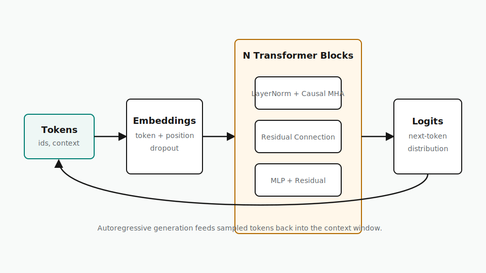

# Transformer From Scratch

Module 1 uses the local implementation in [`src/transformer_from_scratch.py`](https://github.com/logan1085/ai-residency/blob/main/src/transformer_from_scratch.py) and the architecture diagram below.



## What the Code Covers

- Token and positional embeddings.
- Scaled dot-product attention.
- Multi-head causal self-attention.
- Feed-forward blocks with residual connections and layer normalization.
- Autoregressive generation from logits.

Run the smoke test:

```bash
pytest tests/test_transformer_from_scratch.py
```
